# Chrwme Trading Bible｜中文技术校订版

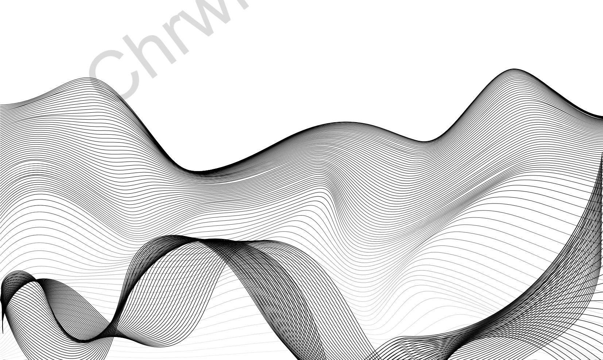

## 目录

### 引言
- 引言（Introduction）— 3
- 市场结构（Market Structure）— 4
- SMC 入场检查清单（SMC Entry Checklist）— 8

### 核心内容
- 流动性（Liquidity）— 10
- 订单块（Order Blocks）— 12
- Breaker Block — 15
- 公平价值缺口（Fair Value Gap, FVG）— 18
- 多头模型基础（Bullish Model）— 21
- 空头模型基础（Bearish Model）— 23

### 方法
- 自上而下分析（Top Down Analysis）— 26
- 吸筹（Accumulation）— 30
- 派发（Distribution）— 32
- 第二阶段吸筹——吸筹完成 / Markup 过渡 — 34
- 第二阶段派发——派发完成 / Markdown 过渡 — 36
- 定义交易区间 / 日内方向（Trading Range / Daily Bias）— 38
- 我的交易模型（My Trading Model）— 40
- 风险管理（Risk Management）— 44

---
# 1. 引言（Introduction）

## Chrwme

你好，我叫 Chrwme。在过去五年中，我一直积极参与交易，并逐渐建立了对市场动态和交易策略的深入理解。过去三年里，我也一直致力于教学，与他人分享自己的知识，并帮助他们理解和应对交易中的复杂问题。作为交易者和教育者的双重经验，使我能够形成一套更有效的市场理解和交易方法。

---
# 2. 市场结构（Market Structure）

## 多头 / 空头结构（Bullish / Bearish Structure）

SMC/ICT 不同教学体系对结构术语的使用并不完全统一。本校订版统一采用以下定义：

- **Change of Character（CHoCH，结构性质转变）：** 市场首次对原有趋势方向形成反向的、具有意义的关键 Swing Point（摆动点）突破。不能仅因为价格轻微刺穿一个无关紧要的小级别 Swing，就直接判定为 CHoCH。
- **Market Structure Shift（MSS，市场结构转移）：** 更强调确认意义的结构转变，通常应伴随对相关关键 Swing 的明显 **Displacement（位移）**，并结合 Liquidity（流动性）与上下文判断。
- **Break of Structure（BOS，结构突破）：** 在结构已经完成转变或趋势已经确立后，价格沿既有结构方向继续突破关键 Swing，用于确认趋势延续。

在多头转变中，价格通常先形成一个具有意义的低点，随后突破相关 Swing High；在空头转变中，价格通常先形成一个具有意义的高点，随后跌破相关 Swing Low。

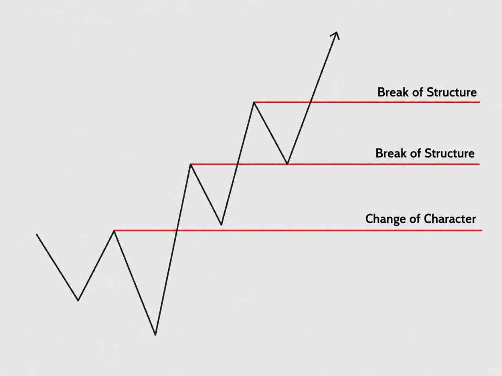
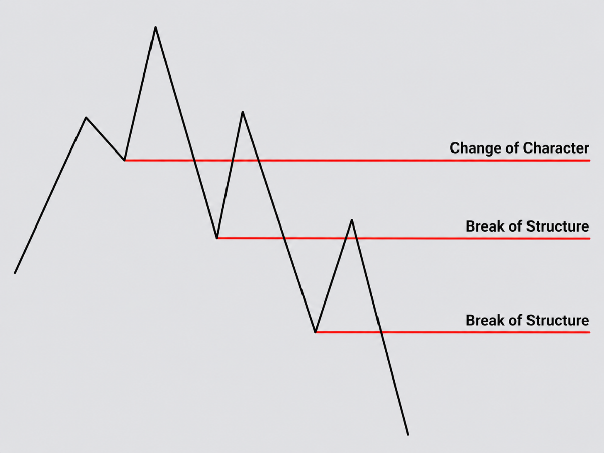

## 多头结构（Bullish Structure）

当价格形成一个具有意义的低点后，以较明确的价格推动突破此前相关 Swing High，可认为多头结构开始建立。相比仅靠影线短暂刺穿，伴随 Displacement 且 K 线实体有效收于关键位置之外，通常能提供更强确认。

在 Bullish 环境中，可在价格回撤至被突破 Swing、Order Block、Fair Value Gap 或其他相互配合的 PD Array 附近时寻找做多机会，但仍需结合高时间周期方向以及事先定义的风险计划。

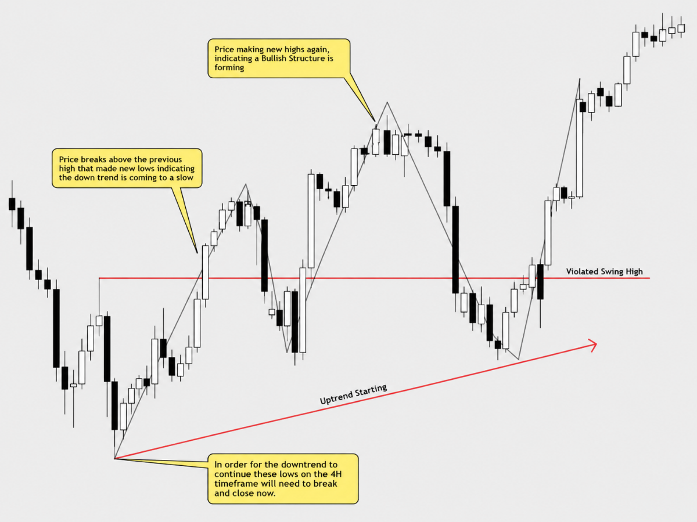

## 空头结构（Bearish Structure）

当价格形成一个具有意义的高点后，以较明确的价格推动跌破此前相关 Swing Low，可认为空头结构开始建立。相比仅靠影线短暂刺穿，伴随 Displacement 且 K 线实体有效收于关键位置之外，通常能提供更强确认。

在 Bearish 环境中，可在价格反弹至被跌破 Swing、Order Block、Fair Value Gap 或其他相互配合的 PD Array 附近时寻找做空机会，但仍需结合高时间周期方向以及事先定义的风险计划。

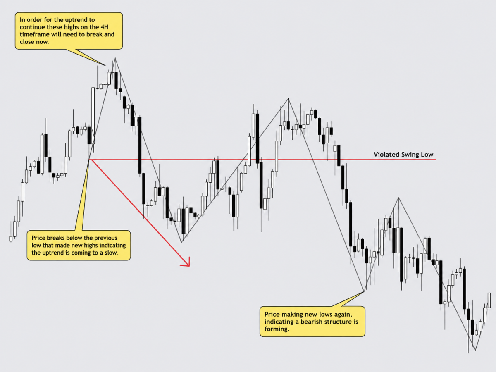

---
# 3. SMC 入场检查清单（SMC Entry Checklist）

- 识别潜在 **Liquidity Grab / Liquidity Sweep（流动性扫取）**：如 PDH/PDL、London Highs/Lows、Equal Highs/Lows 或其他重要 External Liquidity（外部流动性）。
- 等待价格突破一个**具有意义的** High/Low，并出现清晰 **Displacement**，形成 MSS/CHoCH，而不是把任意小级别 Swing 的刺穿都当成结构转变。
- 识别由该次 Displacement 形成或确认的有效 **Order Block / Fair Value Gap / Breaker Block**。
- 等待价格回到选定的 PD Array，并确认高时间周期方向与 Liquidity Target（流动性目标）仍保持一致。
- 入场前明确失效条件、Stop Loss、Target、Position Size 与 **Risk-to-Reward（R:R，风险回报比）**。如果沿用作者原来的筛选规则，可以把 1:1 作为最低门槛，但策略最终是否有效，应由历史 Expectancy（期望值）验证，而不是仅由固定 R:R 决定。

---
# 4. 流动性（Liquidity）

## 潜在流动性池识别（Identification of Potential Liquidity Pools）

- Previous Day / Week / Month Highs and Lows（前一日 / 周 / 月高低点）
- Equal Highs / Equal Lows（等高点 / 等低点）
- London Session Highs / Lows（伦敦时段高低点）
- 其他明显的市场交易时段高低点
- 清晰可见的 Swing High / Swing Low，其附近可能集中 Stop 或 Breakout Orders

## 为什么这些位置重要

在 SMC/ICT 框架中，明显高低点通常被视为**潜在 Liquidity Pools（流动性池）**，因为 Stop Loss、Breakout Orders 及其他 Resting Orders（挂单）可能集中在这些区域。

- **Stop-Loss Orders（止损单）：** 交易者常将保护性止损设置在近期 Swing High 或 Swing Low 之外。
- **Breakout Orders（突破挂单）：** 阻力上方可能存在 Buy Stop，支撑下方可能存在 Sell Stop。
- **Liquidity for Larger Orders（大额订单所需流动性）：** 大型参与者通常需要足够的对手方流动性来更高效地完成较大规模的建仓或减仓。但仅凭 K 线无法证明某个具体机构“故意把价格推到某个位置”来完成订单，因此这一说法应理解为 SMC/ICT 的解释框架，而不是能够从图表直接验证的客观事实。

## 当价格接近潜在流动性池时

- 随着挂单被触发，价格可能加速接近该位置。
- 价格短暂穿越关键高低点后回到原区域，可形成 **Liquidity Sweep（流动性扫取）**。
- Sweep **并不保证反转**。之后可能出现反转、盘整，也可能继续突破，必须结合高时间周期结构、Displacement、后续价格行为等进行确认。

## 交易 Liquidity Sweep

- **Anticipation（预判）：** 根据 Market Structure 和 Higher-Timeframe Context 提前标记潜在流动性池。
- **Confirmation（确认）：** 不预设每次 Sweep 都会反转，应等待有意义的 CHoCH/MSS、Displacement 及有效 PD Array。
- **Execution（执行）：** 在反转或延续情景得到确认后再安排入场，并在交易前明确 Invalidation（失效点）和 Target。

---
# 5. 订单块（Order Blocks）

## 多头订单块（Bullish Order Block）

在 SMC/ICT 术语中，**Bullish Order Block（Bullish OB，多头订单块）**通常指一次具有意义的 Bullish Displacement 之前最后一根 Bearish Candle，或与其紧密相关的一小组反向 K 线；该次推动应产生清晰的结构结果。它通常被解释为强势买盘从该区域发起，但图表本身不能独立证明参与者的具体身份或意图。

### 特征（Characteristics）

- **Location（位置）：** 可以出现在重要低点附近的反转结构中，也可以出现在已经建立的多头结构内部作为 Continuation Setup（延续结构）；并非只能位于整个下跌趋势的绝对底部。
- **Formation（形成）：** 通常为明显 Bullish Displacement 之前最后一根反向 Bearish Candle。
- **Validation（有效性）：** 如果从 OB 发起的推动能够突破相关关键 Swing、符合高时间周期 Bias，并指向清晰 Liquidity Target，其参考价值通常更高。
- **Trading Strategy（交易方式）：** 等待价格回到 OB，再根据反应、结构及 Invalidation 判断是否做多，而不是机械认为价格触及 OB 就必然反弹。

## 空头订单块（Bearish Order Block）

在 SMC/ICT 术语中，**Bearish Order Block（Bearish OB，空头订单块）**通常指一次具有意义的 Bearish Displacement 之前最后一根 Bullish Candle，或与其紧密相关的一小组反向 K 线；该次推动应产生清晰的结构结果。它通常被解释为强势卖盘从该区域发起。

### 特征（Characteristics）

- **Location（位置）：** 可以出现在重要高点附近的反转结构中，也可以出现在已经建立的空头结构内部作为 Continuation Setup；并非只能位于整个上涨趋势的绝对顶部。
- **Formation（形成）：** 通常为明显 Bearish Displacement 之前最后一根反向 Bullish Candle。
- **Validation（有效性）：** 如果从 OB 发起的推动能够跌破相关关键 Swing、符合高时间周期 Bias，并指向清晰 Liquidity Target，其参考价值通常更高。
- **Trading Strategy（交易方式）：** 等待价格回到 OB，再根据反应、结构及 Invalidation 判断是否做空。

## 示例（Examples）

### Bullish Order Block 示例
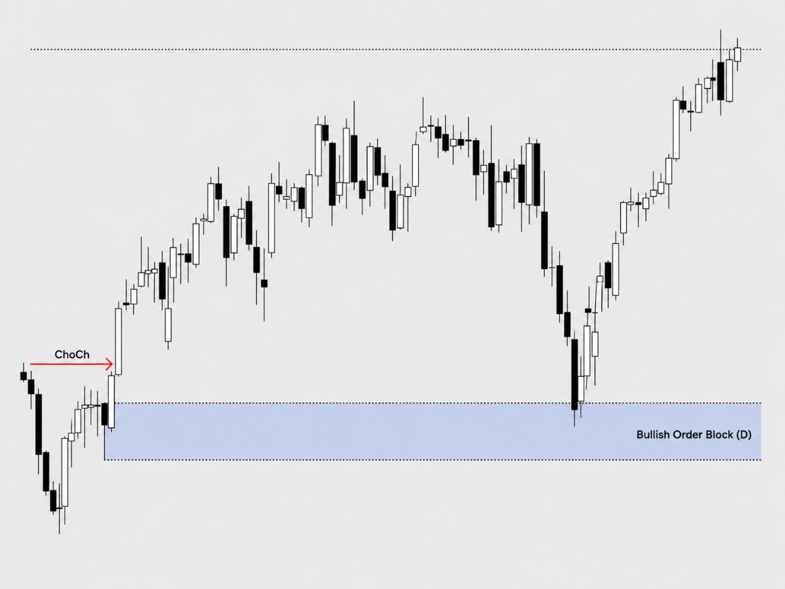

### Bearish Order Block 示例
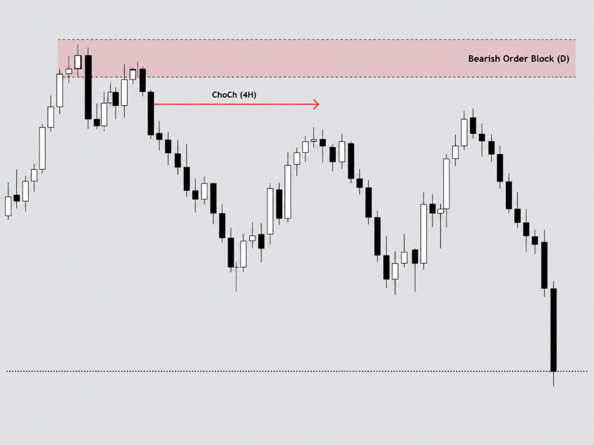

---
# 6. Breaker Blocks（失效订单块 / 破坏块）

## Breaker Block 解释

**Breaker Block** 并不是单纯“盘整后突破、随后变成支撑或阻力”的区域。在 ICT/SMC 中，Breaker Block 更准确的含义是：**原有 Order Block 失效后发生 Polarity Flip（角色反转）形成的区域**。

- **Bullish Breaker：** 通常源自一个 Bearish Order Block 失效。价格以明显 Bullish Displacement 向上穿越该 Bearish OB，并形成结构确认；之后价格回撤到原 Bearish OB 区域时，该区域可能由原来的阻力角色转化为支撑。
- **Bearish Breaker：** 通常源自一个 Bullish Order Block 失效。价格以明显 Bearish Displacement 向下穿越该 Bullish OB，并形成结构确认；之后价格反弹到原 Bullish OB 区域时，该区域可能由原来的支撑角色转化为阻力。

## 形成过程（Formation）

质量较高的 Breaker Block 通常包含以下过程：

1. 先形成一个有效 Order Block。
2. 该 Order Block 未能继续发挥原有作用，出现失效。
3. 价格以明显 Displacement 穿越该区域，并在新的方向上形成结构转移或延续确认。
4. 价格随后回测该已经失效的 OB 区域。
5. 从相反一侧重新评估该区域是否作为新的 Support / Resistance 发挥作用。

## 识别（Identification）

重点观察：

- 是否存在清晰的前置 Order Block；
- 对 Order Block 的突破是否足够明确，而不是仅有短暂 Wick（影线）刺穿；
- 是否出现有意义的结构变化和/或 Displacement；
- 价格是否从相反一侧重新回到同一个失效 OB 区域。

## 交易应用（Usage in Trading）

- **Polarity Flip（角色反转）：** 核心不是“有一个区域”，而是原支撑转为阻力，或原阻力转为支撑。
- **Entry Context（入场背景）：** 当 Breaker 的回测与高时间周期 Bias、Liquidity Objective 以及清晰 Invalidation 相互一致时，可作为潜在入场区域。
- **不是独立信号：** 价格回到某个旧区域，并不代表 Breaker 自动有效。

## 示例（Examples）

### Bullish Breaker Block 示例
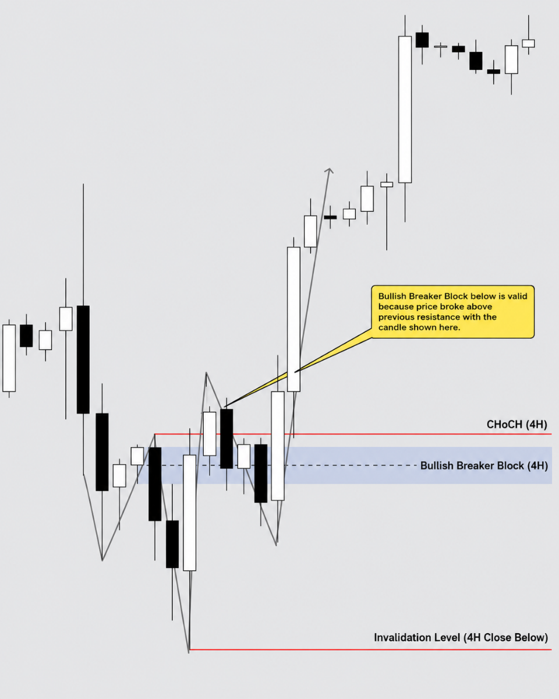

### Bearish Breaker Block 示例
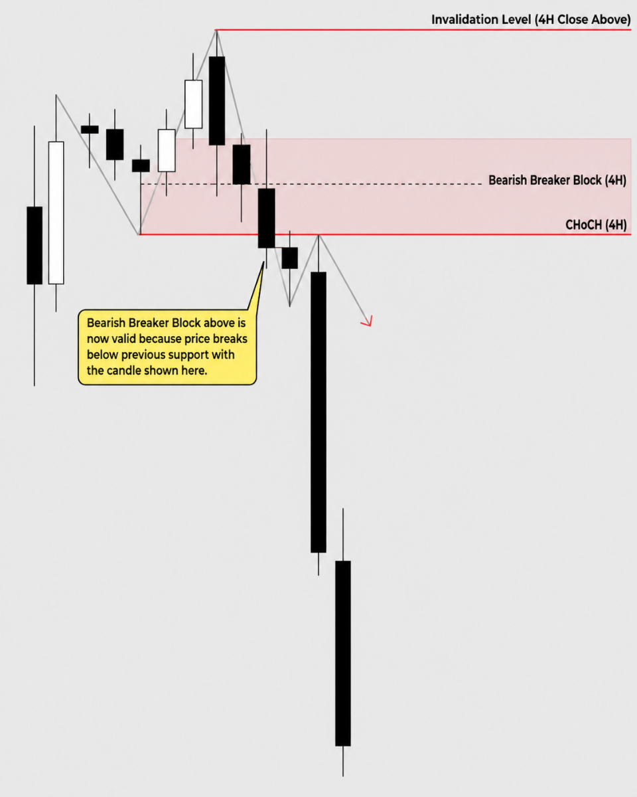

---
# 7. 公平价值缺口（Fair Value Gap, FVG）

## Fair Value Gap 解释

ICT/SMC 中的 **Fair Value Gap（FVG，公平价值缺口）**是一个**三根 K 线构成的价格交付失衡结构**。其机械定义是：Candle 1 的 Wick（影线极值）与 Candle 3 的相对一侧 Wick 不发生重叠，通常围绕一根具有明显 Displacement 的 Candle 2 形成。

这里不能字面写成“该区域完全没有发生交易”：实际上 Candle 2 已经经过这些价格。更准确的理解是，价格在这一段进行了较单边的快速交付，使 Candle 1 与 Candle 3 之间留下可见的非重叠区。在 ICT/SMC 框架中，这被解释为 Inefficiency / Imbalance（效率不足 / 失衡），价格以后**可能**回到该区域进行再平衡，但并不存在“所有 FVG 必然回补”的保证。

## FVG 特征（Characteristics）

### Bullish FVG

- 条件：**Candle 1 High < Candle 3 Low**。
- FVG 区域位于 Candle 1 High 与 Candle 3 Low 之间。
- Candle 2 通常表现出明显 Bullish Displacement。

### Bearish FVG

- 条件：**Candle 1 Low > Candle 3 High**。
- FVG 区域位于 Candle 3 High 与 Candle 1 Low 之间。
- Candle 2 通常表现出明显 Bearish Displacement。

### 意义（Significance）

- 在 ICT/SMC 中，该结构代表三根 K 线价格交付中的可见失衡。
- 如果 FVG 由有意义的 Displacement 形成，且之前发生 Liquidity Event，同时与高时间周期 Bias 一致，通常比随机出现的三根 K 线非重叠更有参考价值。
- 价格可能部分回补、完全回补、直接忽略，甚至完全穿越 FVG，因此不应假设每个 FVG 都必须被填补。

## 示例（Examples）

### Bullish Fair Value Gap 示例
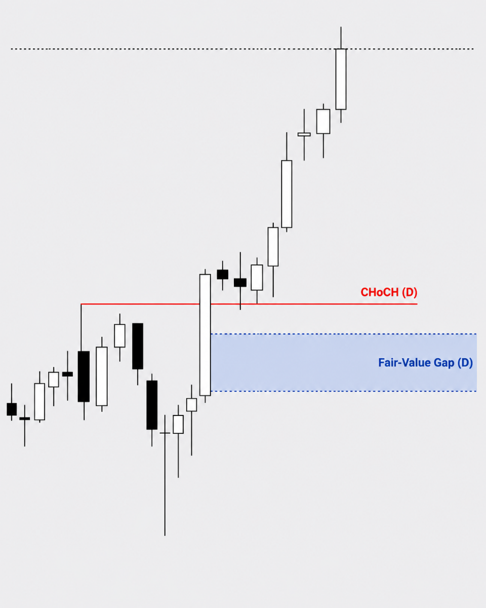

### Bearish Fair Value Gap 示例
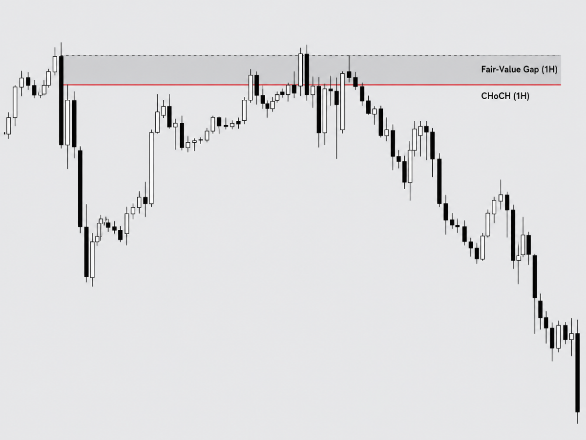

---
# 8. 多头模型（Bullish Model）

## 术语说明（Terminology Note）

原书在这个个人 Bullish Model 中使用了 **Accumulation** 和 **Distribution**，但其含义与后文 Wyckoff 的 Accumulation / Distribution 并不相同。为避免混淆，本校订版保留原作者标签，同时增加描述性名称；这里的术语**不能直接按 Wyckoff 阶段理解**。

## Buy Model 阶段（Phases of the Buy Model）

- **Consolidation（盘整）：** 价格维持区间震荡，在区间上下两侧形成明显 Liquidity。
- **Distribution / Sell-Side Expansion（作者模型中的“派发 / 向下扩张”）：** 价格向下离开 Consolidation，朝此前识别出的 Discount Area（折价区域）运行。这里的 Distribution **不是 Wyckoff Distribution**。
- **Market Reversal（市场反转）：** 在 Higher-Timeframe Discount Area 形成具有意义的低点，并通过结构确认 / Displacement 转为 Bullish。
- **Accumulation / Long Position-Building（作者模型中的“积累 / 多头建仓”）：** 第一段和第二段回撤可能提供分批建立或进入 Long Position 的机会。这里不一定构成标准 Wyckoff Accumulation Trading Range。
- **Model Complete（模型完成）：** 价格上穿原 Consolidation 高点并获取 Buy-Side Liquidity。此前 Resistance 此后可以被评估为 Potential Support，但不能机械假设一定完成 Support/Resistance Flip。

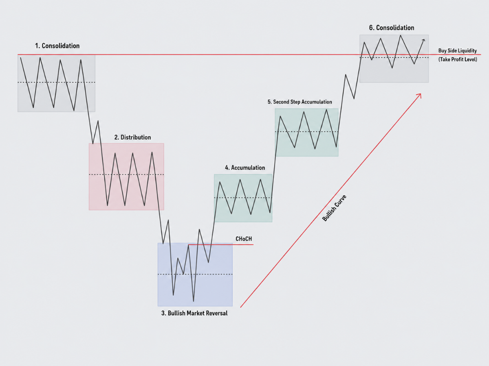

---
# 9. 空头模型（Bearish Model）

## 术语说明（Terminology Note）

原书在这个个人 Bearish Model 中同样使用了 **Accumulation** 和 **Distribution**，但其含义与后文 Wyckoff 章节不同。本校订版保留原作者标签并增加描述性名称，避免将两套体系混为一谈。

## Sell Model 阶段（Phases of the Sell Model）

- **Consolidation（盘整）：** 价格维持区间震荡，并在区间上下两侧形成明显 Liquidity。
- **Accumulation / Buy-Side Expansion（作者模型中的“积累 / 向上扩张”）：** 价格向上离开 Consolidation，朝此前识别出的 Premium Area（溢价区域）运行。这里不一定是 Wyckoff Accumulation。
- **Market Reversal（市场反转）：** 在 Higher-Timeframe Premium Area 形成具有意义的高点，并通过结构确认 / Displacement 转为 Bearish。
- **Distribution / Short Position-Building（作者模型中的“派发 / 空头建仓”）：** 第一段和第二段反弹可能提供分批建立或进入 Short Position 的机会。这里不一定构成标准 Wyckoff Distribution Trading Range。
- **Model Complete（模型完成）：** 价格跌破原 Consolidation 低点并获取 Sell-Side Liquidity。此前 Support 此后可以被评估为 Potential Resistance，但不能机械假设一定完成 Support/Resistance Flip。

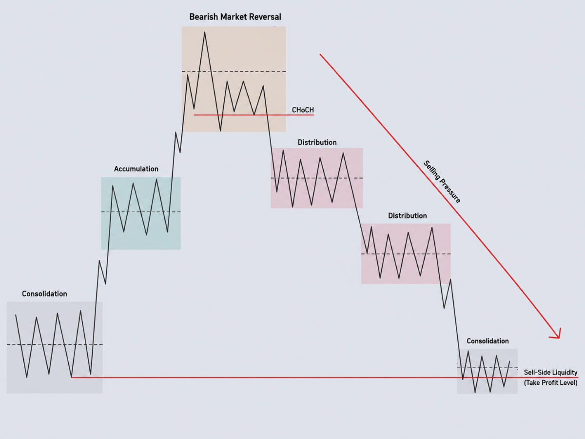

## Bullish / Bearish Model 示例

### Bullish Model 示例
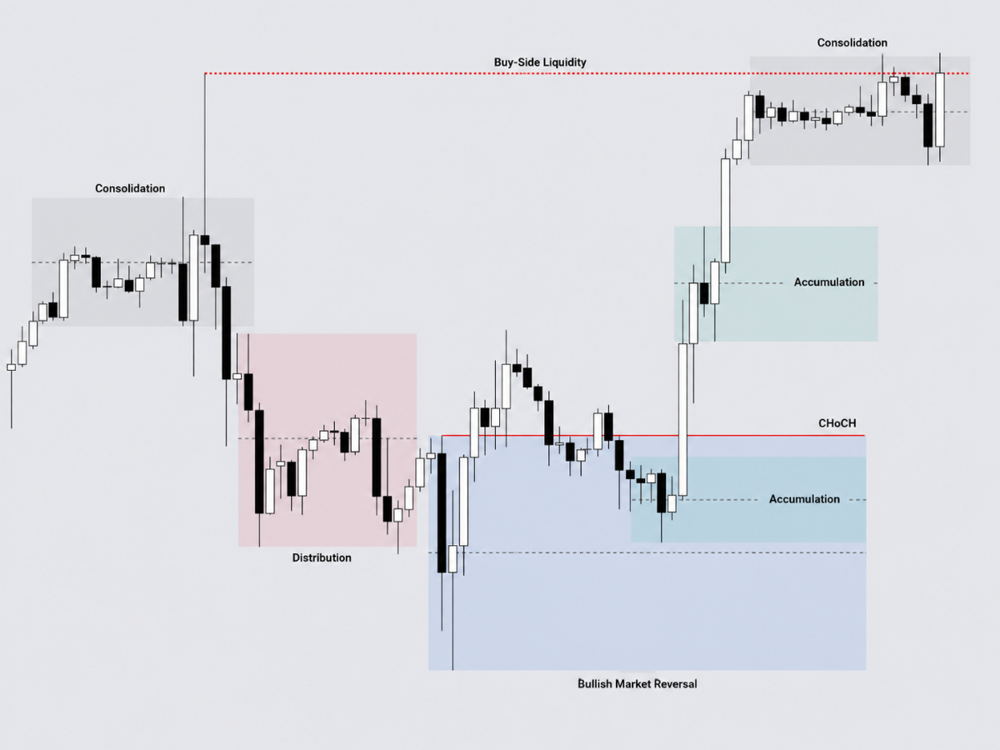

### Bearish Model 示例
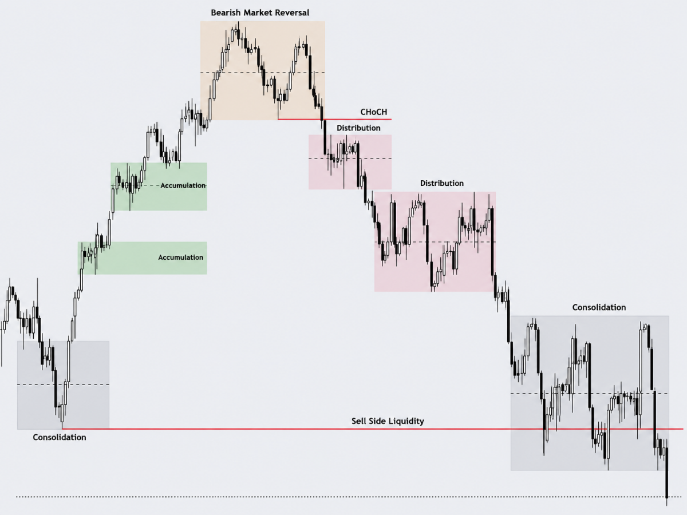

---
# 10. 自上而下分析（Top Down Analysis）

## 从高时间周期开始（Start with Higher Time Frames）

- **Monthly and Weekly Charts（月线和周线）：** 用于识别长期趋势以及重要支撑、阻力位置。理解更大级别的市场结构非常重要，包括趋势、Range（区间）以及可能影响未来价格运动的关键位置。

### 识别关键位置和区域（Identify Key Levels and Zones）

- **Support and Resistance（支撑与阻力）：** 在高时间周期上寻找主要支撑与阻力、Supply and Demand Zones（供需区域）以及 Institutional Levels（机构关键位置）。这些位置通常是历史上价格出现强烈反应的区域，因此未来也可能再次产生反应。
- **Market Structure（市场结构）：** 判断整体市场结构，例如上涨趋势中的 Higher Highs / Higher Lows（更高高点 / 更高低点），或下跌趋势中的 Lower Highs / Lower Lows（更低高点 / 更低低点）。这有助于理解当前市场情绪以及潜在的后续价格方向。

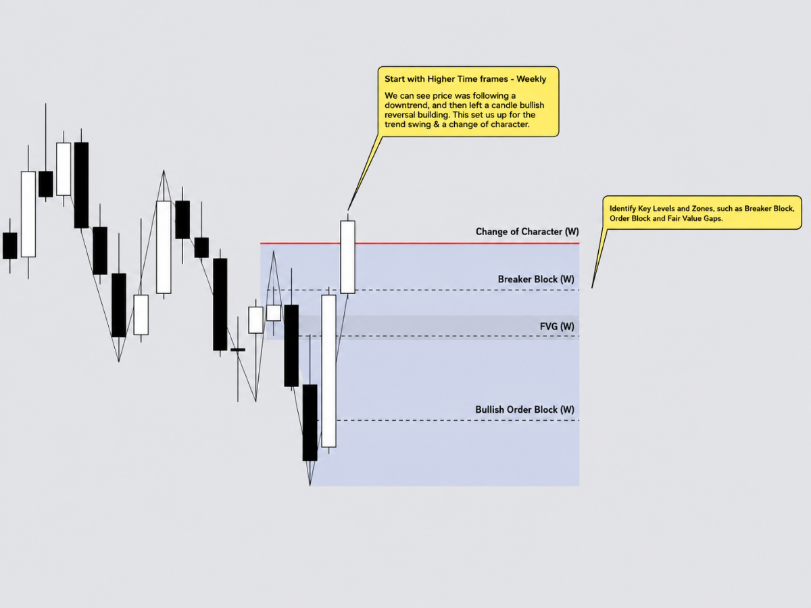

## 在较低时间周期上细化分析（Refine Analysis on Lower Time Frames）

- **Daily and 4-Hour Charts（日线和 4 小时图）：** 用这些时间周期进一步细化分析，并确认高时间周期上识别出的关键位置。结合整体市场背景，可以更精确地寻找 Entry / Exit（进场 / 出场）位置。
- **Pattern Recognition（形态识别）：** 寻找与高时间周期分析方向一致的 Price Action Patterns（价格行为形态），例如 Breakout（突破）、Retest（回测 / 回踩）以及 Consolidation（盘整）。

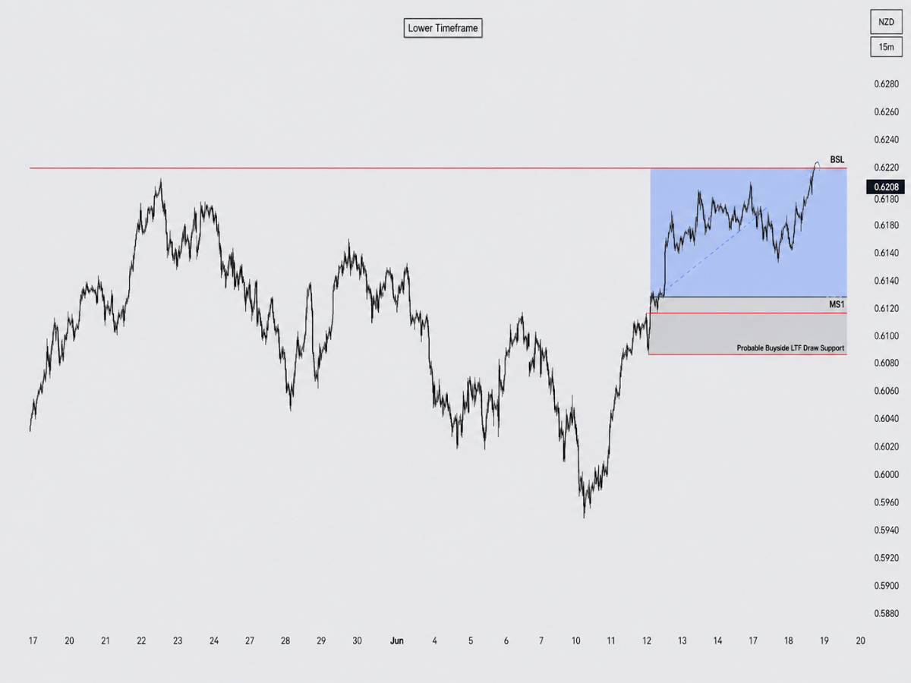
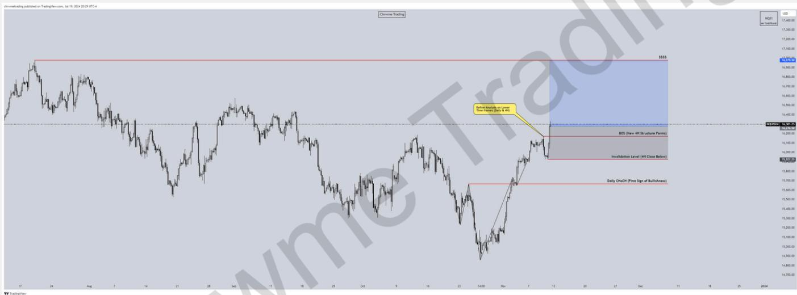

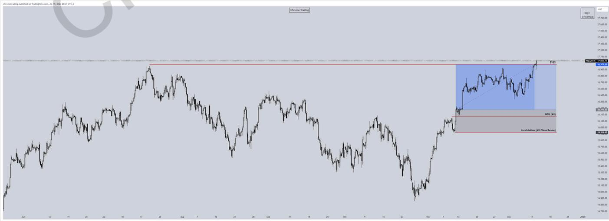

## 在更低时间周期执行交易（Execute on Even Lower Time Frames）

- **1-Hour and Lower Charts（1 小时及以下图表）：** 当高时间周期已经给出清晰的市场背景和潜在交易区域后，可使用更低时间周期寻找精确的 Entry / Exit。应寻找高低时间周期之间的 Confluence（共振 / 一致性），以提高交易成功概率。
- **Entry Triggers（入场触发）：** 寻找能够确认高时间周期分析的具体触发信号，例如 Candlestick Patterns（K 线形态）、Momentum Shifts（动能变化）以及其他技术指标。

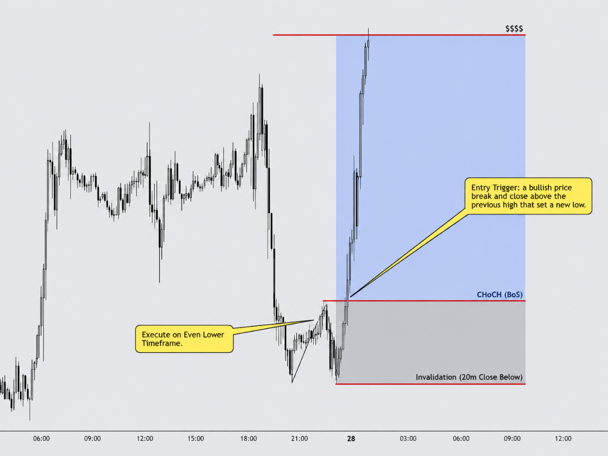
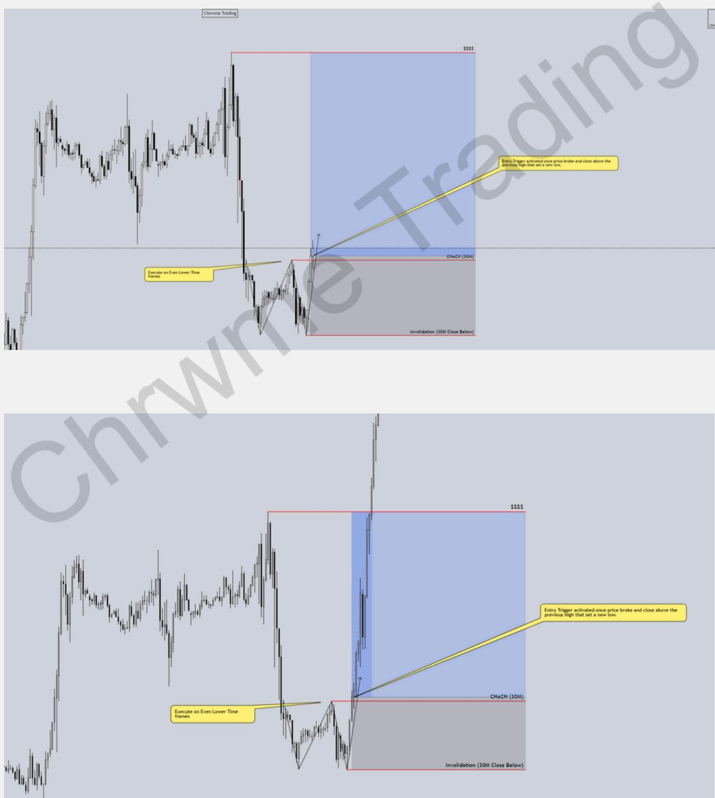

---
# 11. 吸筹（Accumulation）

## Wyckoff Schematic（威科夫图式）

Wyckoff **Accumulation Trading Range（吸筹交易区间，TR）**通常发生在一段下跌之后，市场中的 Supply（供给）逐步被吸收，并为潜在 **Markup（上涨阶段）**做准备。实际结构可能存在多种变体，并不是每一个事件都必须出现。

- **Preliminary Support（PS，初步支撑）：** 在持续下跌后，较明显的买盘开始进入，使原有跌势减缓。
- **Selling Climax（SC，卖出高潮）：** 抛售压力达到高潮，常伴随较大的价格 Spread（价差 / 振幅）与较高成交量。
- **Automatic Rally（AR，自动反弹）：** 强烈卖压暂时减弱后，价格自然反弹；AR 有助于定义 Trading Range 的上边界。
- **Secondary Test（ST，二次测试）：** 价格重新测试 SC 附近，确认 Supply 是否已经减弱。一个结构中可以出现多个 ST。
- **Spring / Shakeout（Spring / 震仓，可选）：** 价格跌破已经建立的支撑后重新回到 TR，用于测试剩余 Supply。**Spring 并不是必需事件**，合法的 Accumulation 也可以没有 Spring。
- **Test（测试）：** 对 Spring / Shakeout 或其他潜在 Supply 区域再次测试，理想情况下卖压应进一步减弱。
- **Sign of Strength（SOS，强势信号）：** 价格出现较强推进，显示 Demand（需求）增强，并开始挑战或突破 Resistance。
- **Last Point of Support（LPS，最后支撑点）/ Back-Up（BU，回踩）：** SOS 后的回撤能够守住支撑，进一步证明 Demand 正在压过 Supply。
- **Phase E / Markup：** 价格离开 Accumulation TR，上涨趋势逐步确立。

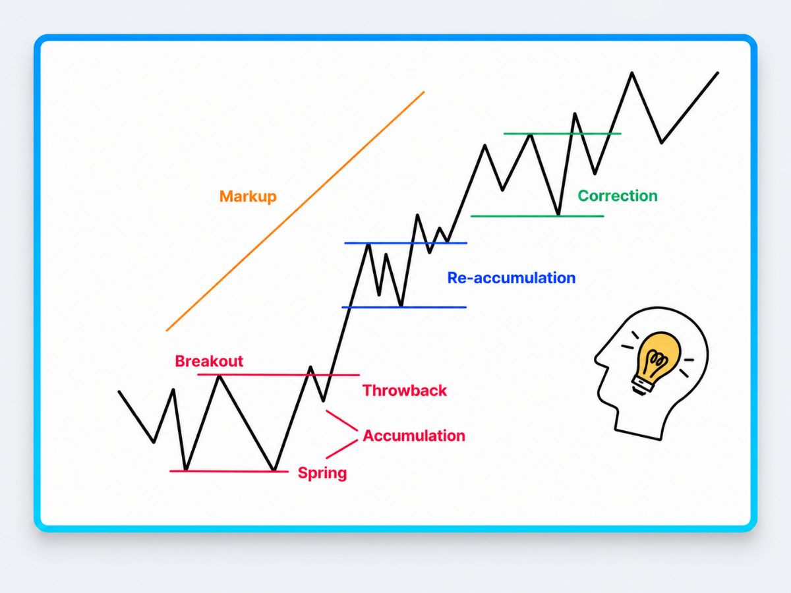

---
# 12. 派发（Distribution）

## Wyckoff Schematic（威科夫图式）

Wyckoff **Distribution Trading Range（派发交易区间，TR）**通常发生在一段上涨之后，Supply 开始逐渐压过 Demand，为潜在 **Markdown（下跌阶段）**做准备。它不能直接照抄 Accumulation 图式，只把标题改成 Distribution。

- **Preliminary Supply（PSY，初步供给）：** 在明显上涨后，大量 Supply 开始进入，使上涨趋势首次出现明显减速迹象。
- **Buying Climax（BC，买入高潮）：** 买入需求达到高潮，公众的强烈买盘在潜在顶部附近被大量 Supply 承接。
- **Automatic Reaction（AR，自动回落）：** BC 后买盘减弱、Supply 活跃，价格自然向下回落；AR 有助于定义 Distribution TR 的下边界。
- **Secondary Test（ST，二次测试）：** 价格重新测试 BC / Resistance 区域，观察 Demand 与 Supply 的平衡。可以出现多个 ST。
- **Upthrust（UT，上冲失败）：** 价格短暂突破 Resistance 后失败，并重新回到 Trading Range。
- **Upthrust After Distribution（UTAD，派发后上冲，可选）：** 发生在后期的假突破，用于测试剩余 Demand。UTAD 可以看作 Distribution 侧与 Spring 对应的结构，但**不是所有 Distribution 都必须出现 UTAD**。
- **Sign of Weakness（SOW，弱势信号）：** 价格跌向或跌破 Support，显示 Supply 正逐步取得优势。
- **Last Point of Supply（LPSY，最后供给点）：** SOW 后出现较弱反弹，无法重新回到此前 Resistance，表明 Demand 衰竭、Supply 仍占优势。
- **Phase E / Markdown：** 价格离开 Distribution TR，下跌趋势逐步确立。

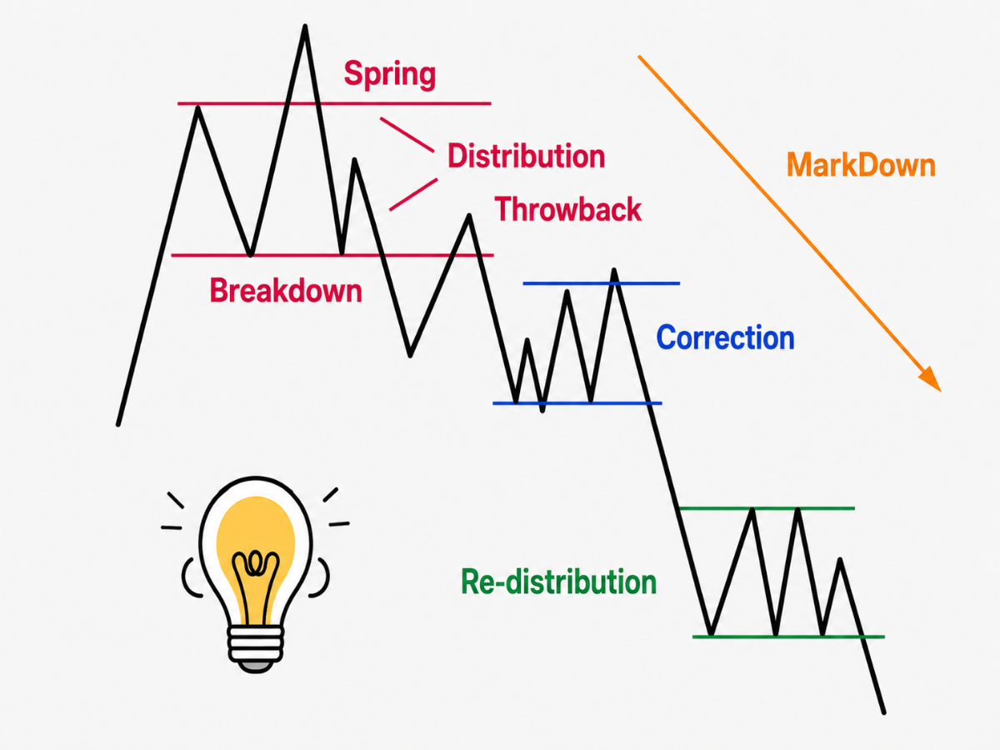

---
# 13. 第二阶段吸筹——吸筹完成 / Markup 过渡

原书把同一个底部 Accumulation 结构的后半程直接称为 **Reaccumulation（再积累）**，这个用法并不准确。按照 Wyckoff 术语，**Reaccumulation** 通常指已经进入 Uptrend / Markup 以后，在更高位置重新形成的新 Trading Range；它不是原始底部 Accumulation 的“第二阶段”。

在最初 **PS → SC → AR → ST** 之后，同一个 Accumulation TR 的后续完成过程可能包括：

- **Phase B Development：** 价格继续在 Trading Range 内运行，Supply 被持续吸收，同时形成进一步的 Cause（蓄势）。
- **Spring / Shakeout and Test（可选）：** 价格可能短暂跌破 Support 后重新回到区间，并通过 Test 验证 Supply 是否继续减弱。该过程并非必需。
- **Sign of Strength（SOS）：** 价格以较明显 Demand 向上推进，挑战或突破 TR Resistance。
- **Last Point of Support（LPS）/ Back-Up（BU）：** SOS 后发生回撤，但仍能守住原 Resistance / 新 Support 附近，说明 Demand 仍占主导。
- **Markup Transition：** Accumulation TR 完成后，价格离开区间并进入持续上涨阶段。

### Reaccumulation 与本章的区别

真正的 **Reaccumulation（再积累）**是：**Markup 已经开始后**，价格在更高位置形成新的 Consolidation / Trading Range，作为原有 Uptrend 的“Stepping Stone（阶梯式中继）”，随后上涨趋势继续。

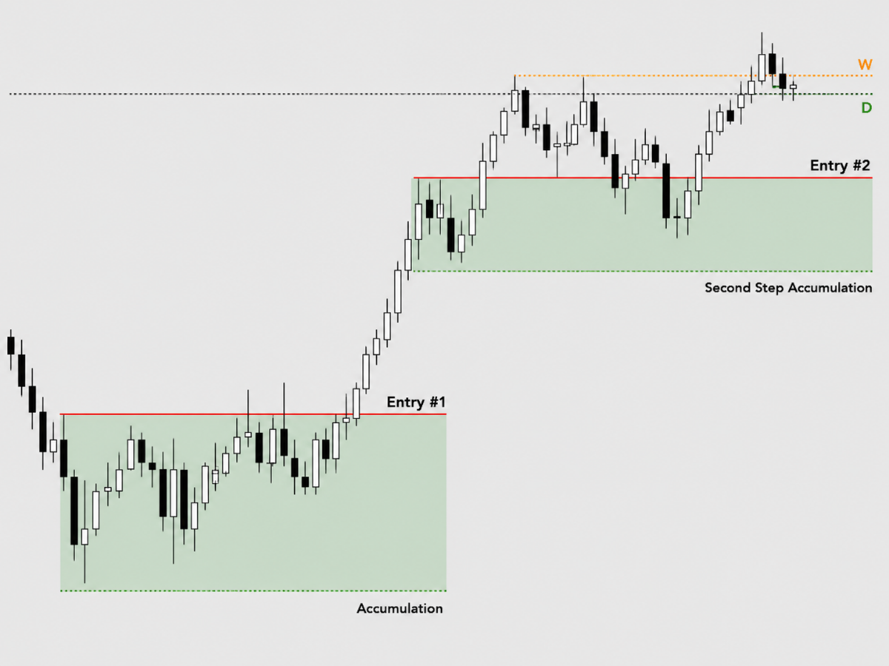

---
# 14. 第二阶段派发——派发完成 / Markdown 过渡

原书这一章复制了 Accumulation 内容，继续使用 **PS/SC/AR/ST、Reaccumulation、accumulation range** 等术语，无法正确描述顶部 Distribution 的后续过程。

在最初 **PSY → BC → AR → ST** 之后，同一个 Distribution TR 的完成过程可能包括：

- **Upthrust / UTAD（可选）：** 价格可能短暂突破 Resistance 后失败。UTAD 属于后期变体，并不是每个 Distribution 都必须出现。
- **Sign of Weakness（SOW）：** 价格向 TR 下边界下跌或跌破 Support，显示 Supply 明显增强。
- **Last Point of Supply（LPSY）：** SOW 后出现较弱 Rally，无法重新返回此前 Resistance，说明 Demand 衰竭、Supply 持续存在。
- **Breakdown / Markdown Transition：** 价格向下离开 Distribution Range，下跌趋势开始或进一步加速。
- **Retest（回测）：** 后续价格可能反弹测试此前 Support，并将其评估为潜在 Resistance，但 Retest 并不是必然发生的步骤。

### Redistribution 与本章的区别

真正的 **Redistribution（再派发）**是：**Markdown / Downtrend 已经开始后**，价格在更低位置形成新的 Consolidation / Trading Range，作为原有下跌趋势中的中继结构，然后 Markdown 继续。它并不是原始 Distribution 顶部的“第二阶段”。

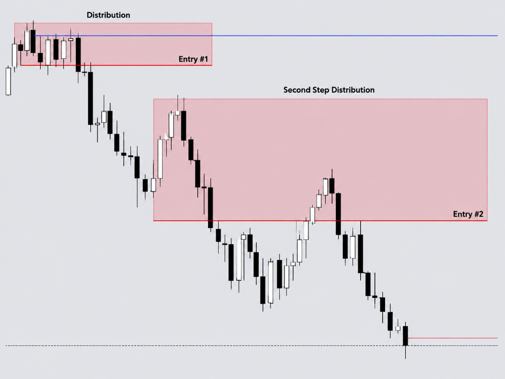

---
# 15. 定义交易区间 / 日内方向（Trading Range / Daily Bias）

## 定义交易区间（Defining Your Trading Range）

Previous Day High（PDH，前一日高点）和 Previous Day Low（PDL，前一日低点）可以用于界定 Daily Bias、External Liquidity 以及潜在 Dealing Range（交易处理区间）。但它们只是重要参考位置，**不能被视为价格必须始终停留其中的固定边界**。

例如：
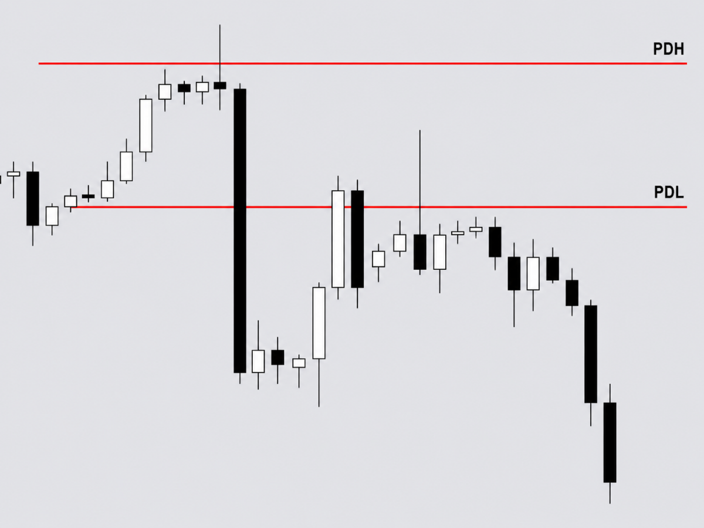

如果价格短暂突破 PDH 后很快重新回到 PDH 下方，并且没有在其上方形成持续 Acceptance（接受 / 站稳），PDH 与 PDL 仍可以作为当天 Working Range（工作区间）的主要参考。是否继续采用该区间，应由后续结构和 Price Delivery 确认，而不是仅靠一次触碰判断。

如果价格以明显 Displacement 跌破 PDL，并在后续反弹中开始把 PDL 当作 Resistance，这种行为可以支持 Bearish Continuation Bias。相反，如果价格在 PDH 上方形成持续 Acceptance，则原来的 Range 假设可能失效，Working Range 需要上移。

因此，PDH / PDL 更适合用于定义可能的 Liquidity Objective 与上下文边界，而不是用于假设市场必然在二者之间运行。

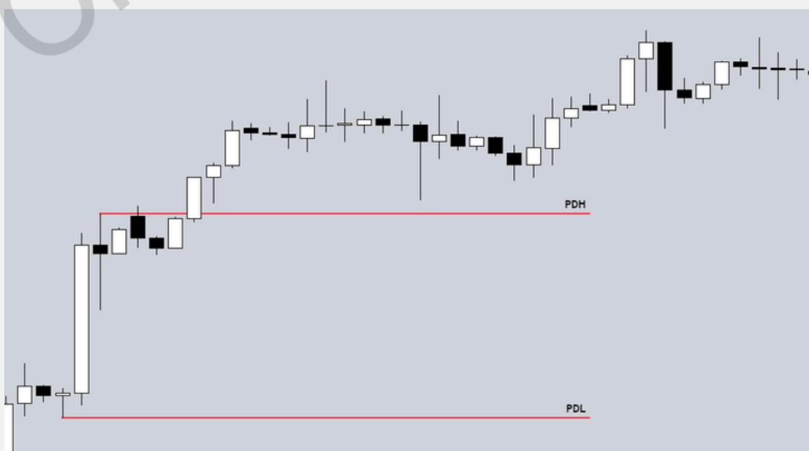

---
# 16. 我的交易模型（My Trading Model）

## SMC 入场检查清单

- 识别潜在 Liquidity Grab / Sweep：PDH/PDL、London Highs/Lows、Equal Highs/Lows 或其他相关 Liquidity Pool。
- 等待价格突破相关 High/Low 并出现 Displacement，形成 MSS/CHoCH，而不是把任意小级别 Swing 的刺穿当成结构转变。
- 识别由该推动形成或确认的有效 Order Block / Fair Value Gap / Breaker Block。
- 等待价格回到选定 PD Array，并确认 Higher-Timeframe Bias 与 Target 仍然一致。
- 入场前定义 Invalidation、Stop、Target、Position Size 和 R:R。如果沿用作者原始筛选条件，可以把 1:1 当作最低门槛，但是否具备交易 Edge（优势）应由历史 Expectancy 验证。

## 我的交易模型

Previous Day High / Low 是本模型主要使用的 External Liquidity 参考。它们用于帮助界定 Working Range，以及潜在 Reversal / Continuation 情景，但不是价格必须遵守的固定边界。

例如：

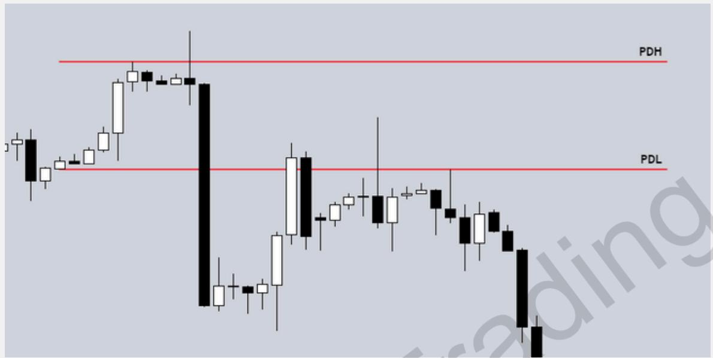

价格短暂突破 PDH 后迅速回落，可以使 PDH-to-PDL Range 继续保持参考价值；如果价格以明显 Displacement 突破并在 PDH 或 PDL 外侧形成 Acceptance，则 Daily Bias 与 Working Range 需要重新评估。

> **作者用法说明：** 原文分别在 PDL Reversal 和 PDH Reversal 下都写了 “This is the model I use 99% of the time”，两处同时成立在逻辑上不一致。本校订版统一理解为：**PDH/PDL Reversal Framework 整体是作者最主要使用的模型**。

## Previous Day Low Reversal（PDL 反转）

**PDL Reversal** 是一个 Bullish Scenario：价格先跌破 PDL、获取 Sell-Side Liquidity，随后以较强 Bullish Price Delivery 重新站回 PDL 上方。如果之后出现 Bullish Displacement / MSS，并出现有效回撤入场区域，则结构确认更强。

例如：

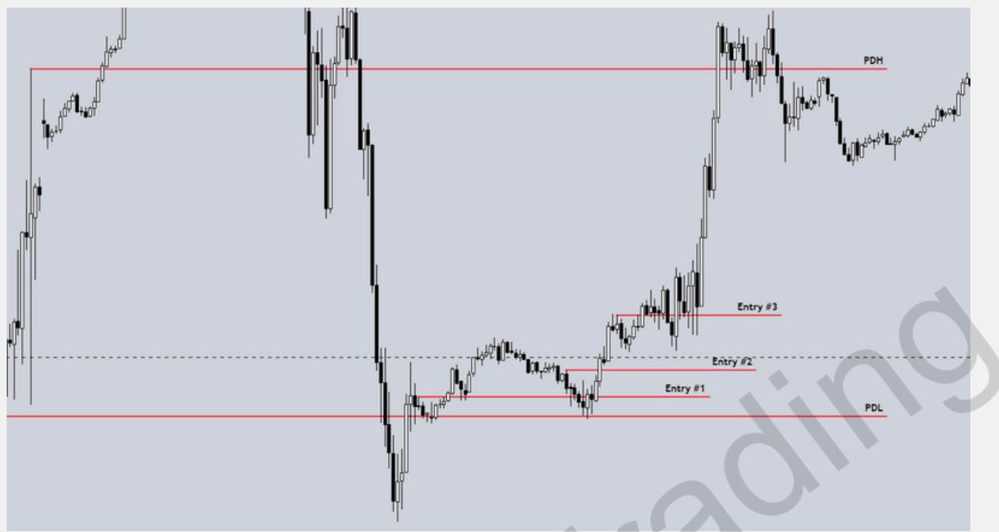

如果价格 Sweep PDL 后以较强力度重新站回 PDL 上方，Working Range 可以重新朝 PDH 方向评估，但仍需结合 Structure 与 Confirmation。

## Previous Day High Reversal（PDH 反转）

**PDH Reversal** 是对应的 Bearish Scenario：价格先突破 PDH、获取 Buy-Side Liquidity，随后以较强 Bearish Price Delivery 重新跌回 PDH 下方。如果之后出现 Bearish Displacement / MSS，并出现有效回撤入场区域，则结构确认更强。

例如：

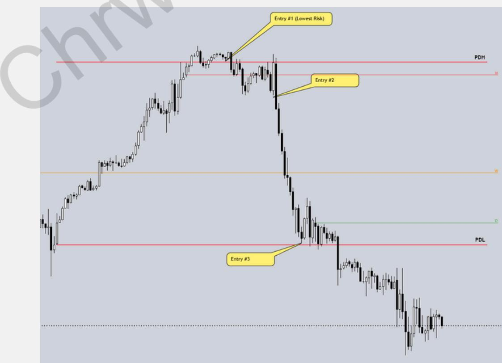

如果价格 Sweep PDH 后重新跌回其下方，Working Range 可以重新朝 PDL 方向评估，但仍需结合 Structure 与 Confirmation。

---
# 17. 风险管理（Risk Management）

## 理解市场结构（Understanding Market Structure）

入场前理解 Market Structure 十分重要。需要提前识别相关 Support / Resistance、Liquidity、Trend Condition、Volatility 以及 Structural Invalidation（结构失效位置）。结构分析可以帮助建立更合理的风险计划，但不能让未来价格运动变成确定事件。

## Risk-Reward Ratio 与 Expectancy

Risk-to-Reward（R:R，风险回报比）有参考价值，但固定要求每笔交易达到 1:2 或 1:3 并不是普适规则。一个交易系统应结合其**历史胜率、平均盈利、平均亏损、交易成本和 Expectancy（期望值）**评估。

简化后的期望值公式：

`Expectancy =（Win Rate × Average Win）−（Loss Rate × Average Loss）− Trading Costs`

即使平均 R 倍数较低，只要胜率足够高，策略仍可能具备正期望；反过来，即使理论 R:R 很高，如果胜率过低或执行成本过大，也不代表系统一定盈利。

## Position Sizing（仓位管理）

Position Size 应根据账户净值、结构失效点 / Stop 的距离，以及交易系统允许的最大风险比例计算。目的不是追求某一笔交易收益最大化，而是避免单笔交易或连续亏损对总资金造成不可接受的损害。

## Stop Loss 与 Take Profit

Stop Loss 和 Take Profit 是风险管理的基础。Stop 应放在交易 Thesis（逻辑）真正失效的位置，并考虑市场 Volatility 与交易品种特性；Target 应结合合理 Liquidity Objective、Market Structure 与经过测试的 Exit Logic，而不是只为了满足某个任意 R 倍数。

## Trade Management（持仓管理）

交易进入持仓状态后，管理规则应尽可能事先确定，例如 Move Stop to Break Even、Partial Profit-Taking、Trailing Stop 或固定 Target。缺乏测试依据、频繁临时改变管理方式，会改变原策略的 Expectancy。

## 避免过度杠杆（Avoiding Over-Leverage）

应谨慎使用 Leverage。过度杠杆会同时放大正常策略波动和执行错误，使一个统计上本来正常的 Losing Streak（连续亏损）演变成不可接受的 Drawdown（回撤）。

## 心理纪律（Psychological Discipline）

风险管理同样要求行为一致性。遵守经过测试的计划，避免因为 Fear / Greed 临时改变规则，并区分“某次交易结果”与“当时决策质量”这两个不同问题。

## Backtesting 与 Strategy Development

Backtesting 用于估计策略在历史数据上的表现，包括 Win Rate、Average R、Drawdown、Losing Streak 以及不同 Market Regime 下的敏感性。历史回测不能保证未来结果，因此还需要 Forward Testing 与持续复盘。

## Risk Assessment Tools（风险评估工具）

Volatility、Market Structure、Historical Adverse Excursion（历史最大不利波动）以及 Liquidity Condition，都可以帮助设置更合理的 Stop Distance 与 Position Size。

## 持续学习（Continuous Learning）

市场环境会变化。有效的风险管理要求持续复盘交易，并在证据发生变化时更新假设；策略调整应建立在数据基础上，而不是因为少数几笔交易的结果就频繁改变系统。

---
# 技术校订说明（Technical Revision Notes）

本版在尽量保留原作者交易框架的前提下，对审核发现的问题进行了以下修正：

- 收紧 Market Structure 定义，避免把任意小级别 Swing 的刺穿自动判定为 CHoCH / MSS。
- 将 Liquidity 中关于“机构必然主动推动价格”的表述降级为 SMC/ICT 的解释框架，而不是可从 K 线直接证明的事实。
- Order Block 不再被限制为只能出现在整个趋势的绝对顶部 / 底部。
- Breaker Block 从普通 Breakout / Retest Zone 修正为“失效 Order Block + Polarity Flip”。
- Fair Value Gap 修正为标准三根 K 线 Candle 1 / Candle 3 非重叠结构。
- 对第 8、9 章作者自定义的 Accumulation / Distribution 与后文 Wyckoff 同名术语进行明确区分。
- Wyckoff Accumulation 增补 Spring/Shakeout（可选）、Test、SOS、LPS/BU、Markup。
- Wyckoff Distribution 修正为 PSY / BC / AR / ST、UT / UTAD（可选）、SOW、LPSY、Markdown。
- 修正第 13、14 章，不再把 Reaccumulation / Redistribution 当作原始底部 / 顶部 Trading Range 的“第二阶段”。
- 将 PDH / PDL 改为 Contextual Liquidity / Range Reference，而不是保证价格运行范围的固定边界。
- 合并第 16 章两个互相冲突的 “99% of the time” 描述，统一为 PDH/PDL Reversal Framework。
- Risk Management 从固定 R:R 规则调整为更加重视 Expectancy 和经过验证的历史表现。

## 技术参考框架（Technical Reference Framework）

- Wyckoff Analytics — *Wyckoff Method*：用于核对 Accumulation / Distribution 的 Events 与 Phases。
- StockCharts ChartSchool — *The Wyckoff Method: A Tutorial*。
- ICT/SMC 教学资料：用于交叉核对 Breaker Block、Fair Value Gap、Order Block 与 Market Structure Shift 的常见定义。

> 本资料仅用于交易教育与方法研究。任何 Setup 或交易框架都不能保证未来收益，交易存在亏损风险。
